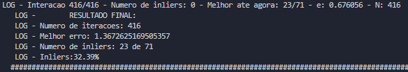
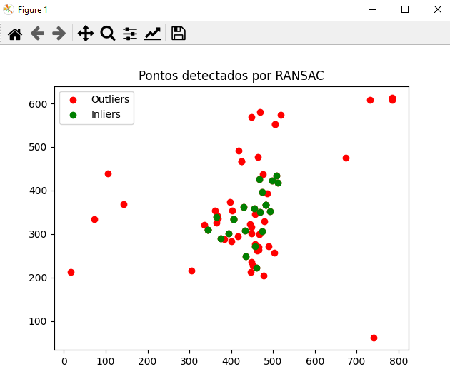
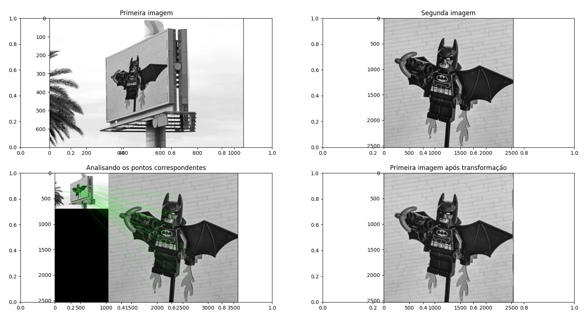
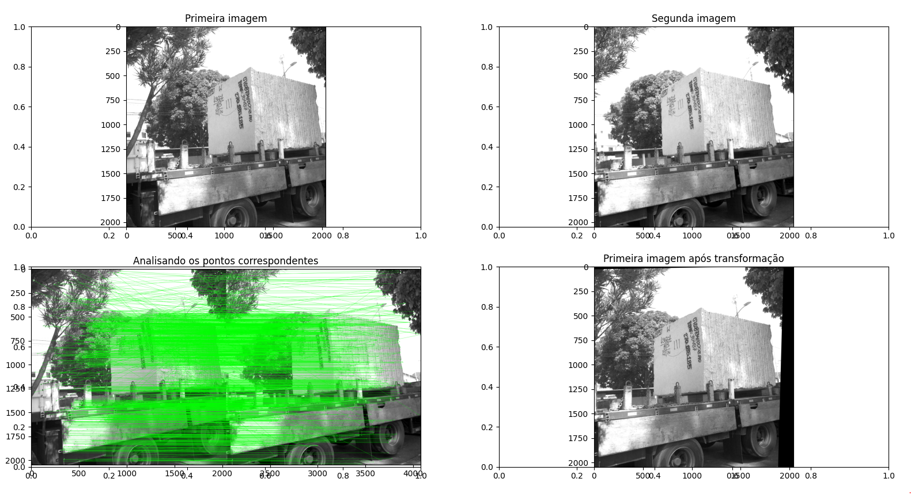
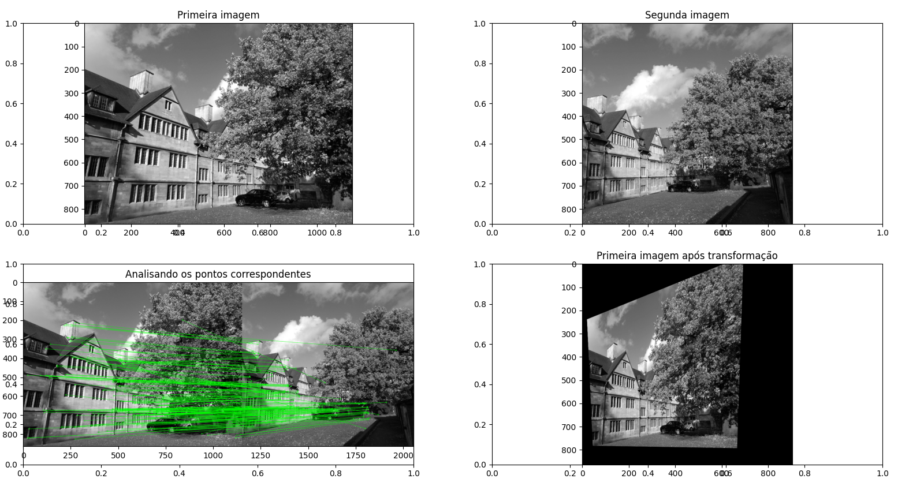
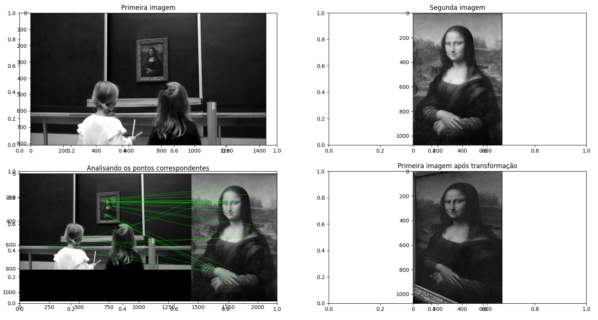
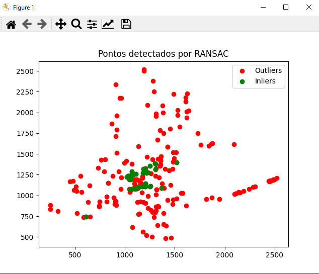
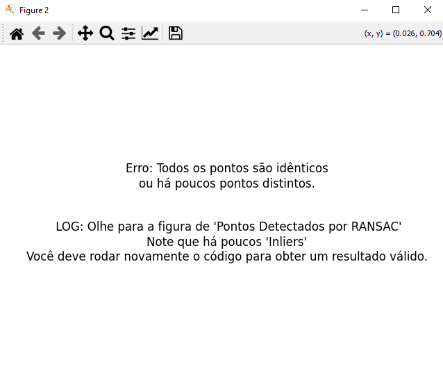

# Estimação de Homografia com RANSAC

## Descrição

Este projeto implementa um algoritmo para estimar a matriz de homografia entre duas imagens utilizando correspondência de pontos detectados com SIFT e refinamento com RANSAC. O código segue uma abordagem estruturada, contendo normalização de pontos, cálculo da matriz de homografia com o algoritmo DLT e aplicação do RANSAC para reduzir a influência de outliers.

## Requisitos

Para executar o código, é necessário ter as seguintes bibliotecas instaladas:

- Python 3.x
- OpenCV
- NumPy
- Matplotlib

Para instalar os pacotes necessários, execute:

```bash
pip install opencv-python numpy matplotlib
```

## Estrutura do Código

O código é dividido nas seguintes funções principais:

### 1. Normalização de Pontos

```python
def normalize_points(points):
```

- Entrada: Matriz de pontos homogêneos.
- Saída: Matriz de transformação e pontos normalizados.

### 2. Cálculo da Homografia com DLT

```python
def my_dlt(pts1, pts2):
```

- Entrada: Dois conjuntos de pontos correspondentes.
- Saída: Matriz de homografia.

### 3. Cálculo da Homografia Normalizada

```python
def my_homography(pts1, pts2):
```

- Entrada: Dois conjuntos de pontos correspondentes.
- Saída: Matriz de homografia ajustada.

### 4. Cálculo do Erro de Reprojeção

```python
def compute_reprojection_error(H, pts1, pts2):
```

- Entrada: Matriz de homografia e pontos correspondentes.
- Saída: Erro médio da reprojeção.

### 5. Implementação do RANSAC

```python
def ransac(pts1, pts2, dis_threshold, p, e, s, N):
```

- Entrada: Correspondência de pontos, limiar de distância, probabilidade desejada, taxa de outliers, número de pontos para amostragem e iterações máximas.
- Saída: Melhor matriz de homografia encontrada e pontos inliers.

## Como Usar

1. Substitua as imagens de entrada nos caminhos indicados no código.
2. Execute o script principal para calcular a homografia e visualizar os resultados.

```bash
python homografia.py
```

3. O programa exibirá as imagens correspondentes e a transformação aplicada.

## Resultados

Inicialmente é mostrado uma figura contendo os inliers e no terminal, LOGs do resultado final da homografia.

<div style="display: inline_block" align="center">

</div>
<div style="display: inline_block" align="center">

</div>
A imagem transformada pela matriz de homografia é visualizada lado a lado com as imagens originais para verificar a qualidade do alinhamento.

<div style="display: inline_block" align="center">

  </div>

### Outros Exemplos:

<div style="display: inline_block" align="center">



  </div>
<div style="display: inline_block" align="center">

  </div>

## Observações

Caso a homografia não der certo (ex: "Todos os pontos são idênticos ou há poucos pontos distintos) é calculado a quantidade de inliers e outliers, mostrado numa figura a quantidade de ambos os pontos e em outra figura, é mostrado oque deve ser feito:

### Figura indicando os inliers e outliers da homografia (Errada):

<div style="display: inline_block" align="center">

  </div>

### Figura indicando oque deve ser feito:

<div style="display: inline_block" align="center">

  </div>
