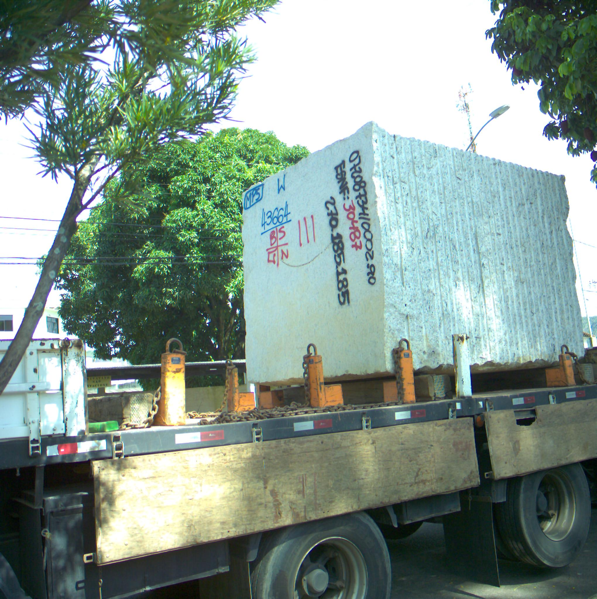
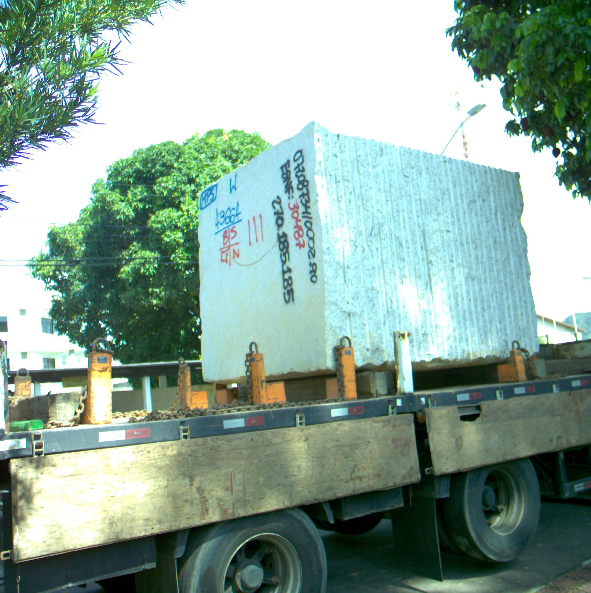
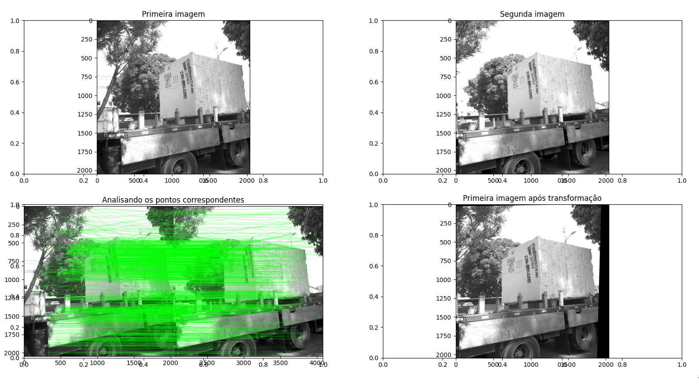

Trabalho 2 de Visão Computacional

## Descrição

Este código implementa um algoritmo de estimação de homografia entre duas imagens utilizando o método de DLT (Direct Linear Transform), normalização de pontos e o algoritmo RANSAC para refinar a homografia.

## Bibliotecas Utilizadas

- `random`: Utilizada para selecionar pontos aleatórios no RANSAC.
- `numpy`: Biblioteca para cálculos matemáticos e manipulação de matrizes.
- `matplotlib.pyplot`: Utilizada para visualização de imagens.
- `math`: Funções matemáticas auxiliares.
- `cv2 (OpenCV)`: Utilizada para manipulação e processamentos de imagens.

## Funções Implementadas

### 1. `my_DLT(pts1, pts2)`

Esta função estima a matriz de homografia entre dois conjuntos de pontos utilizando o método DLT.

**Parâmetros:**

- `pts1`: Array de pontos da primeira imagem.
- `pts2`: Array de pontos correspondentes na segunda imagem.

**Retorno:**

- `H_matrix`: Matriz de homografia estimada.

---

### 2. `normalize_points(points)`

Esta função normaliza os pontos para melhorar a precisão do cálculo da homografia.

**Parâmetros:**

- `points`: Matriz de pontos a serem normalizados.

**Retorno:**

- `T`: Matriz de normalização.
- `norm_pts`: Pontos normalizados.

---

### 3. `my_homography(pts1, pts2)`

Esta função calcula a matriz de homografia utilizando o DLT normalizado.

**Parâmetros:**

- `pts1`: Conjunto de pontos da primeira imagem.
- `pts2`: Conjunto de pontos correspondentes na segunda imagem.

**Retorno:**

- `H`: Matriz de homografia calculada.

---

### 4. `ransac(pts1, pts2, dis_threshold, p, e, s, N)`

Esta função implementa o algoritmo RANSAC para refinar a homografia estimada.

**Parâmetros:**

- `pts1`: Pontos da imagem de origem.
- `pts2`: Pontos correspondentes na imagem destino.
- `max_dist`: Distância máxima para considerar um ponto como inlier.
- `p`: Probabilidade desejada de selecionar um conjunto de inliers livres de outliers.
- `e`: Porcentagem estimada de outliers.
- `s`: Número de pontos necessários para estimar um modelo.
- `N`: Número máximo de iterações.

**Retorno:**

- `H`: Matriz de homografia refinada.
- `pts1_in`: Conjunto de inliers da primeira imagem.
- `pts2_in`: Conjunto de inliers da segunda imagem.

---

### 5. `RANSAC(pts1, pts2, dis_threshold, N, Ninl)`

Outra implementação do algoritmo RANSAC, que seleciona amostras aleatórias, estima a homografia e filtra os inliers.

**Parâmetros:**

- `pts1`: Conjunto de pontos da primeira imagem.
- `pts2`: Conjunto de pontos correspondentes na segunda imagem.
- `dis_threshold`: Limiar de distância para considerar inliers.
- `N`: Número máximo de iterações.
- `Ninl`: Limiar de inliers desejado.

**Retorno:**

- `H`: Matriz de homografia refinada.
- `pts1_in`: Conjunto de inliers da primeira imagem.
- `pts2_in`: Conjunto de inliers da segunda imagem.

---

## Teste com SIFT

A implementação utiliza o detector de pontos característicos SIFT para encontrar correspondências entre duas imagens (`270_left.jpg` e `270_right.jpg`). O algoritmo FLANN é usado para fazer a correspondência de descritores. Os pontos correspondentes são então refinados com RANSAC para calcular a homografia e alinhar as imagens.

## Resultados

    img1 | img2 

A imagem transformada pela matriz de homografia é visualizada lado a lado com as imagens originais para verificar a qualidade do alinhamento.

  

